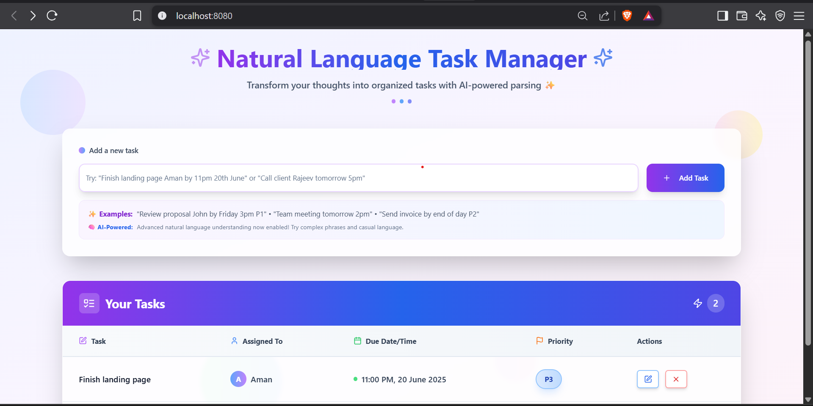
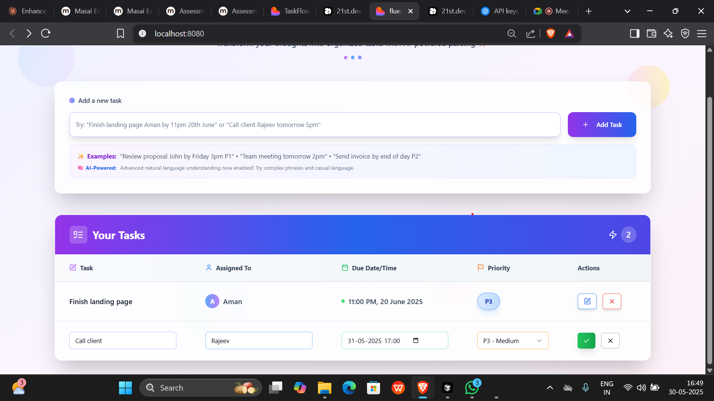

# 🧠 Natural Language Task Manager

Transform your thoughts into organized tasks with AI-powered parsing ✨



## ✨ Key Features

- 🔮 **Advanced AI-Powered Task Parsing**: Leverages OpenAI's GPT-4o for superior natural language understanding
- 🤖 **Multi-Stage Parsing Strategy**: Uses sophisticated AI with regex fallbacks for maximum reliability
- 🎯 **Smart Information Extraction**: Automatically identifies task names, assignees, due dates, and priorities
- 📅 **Intelligent Date Recognition**: Understands relative dates like "tomorrow" and specific formats
- 👤 **Contextual Assignee Detection**: Identifies people mentioned in your task descriptions
- 🔄 **Task Management**: Edit, update, and delete tasks with a beautiful interface
- 🎨 **Modern UI**: Clean, responsive design with smooth animations and gradient accents

## 📸 Screenshots

### Main Interface with AI Parsing


### Editing Tasks


## 🧠 Advanced AI Parsing Architecture

This application implements a sophisticated AI-powered parsing system that transforms natural language into structured task data. Here's a deep dive into how it works:

### 🤖 GPT-4o Prompt Engineering

The core of our system uses a carefully engineered prompt to OpenAI's GPT-4o model:

```javascript
const systemPrompt = `You are a task parsing assistant specialized in extracting structured information from natural language task descriptions.
Output ONLY valid JSON with the following schema, and nothing else - no markdown, no code blocks, no additional text:
{
  "taskName": "The main task description",
  "assignee": "The person assigned to the task (optional)",
  "dueDate": "ISO date string (YYYY-MM-DDTHH:MM) when the task is due (optional)",
  "priority": "P1" | "P2" | "P3" | "P4"
}

VERY IMPORTANT: 
- Respond with ONLY the JSON object, no markdown formatting, no code blocks, no explanations
- Make sure your JSON is properly formatted and can be parsed by JSON.parse()
- Do not use any backticks or markdown formatting in your response

For the taskName:
- Extract the core action and object, remove unnecessary words and context
- Format it as a clear, concise action item starting with a verb when possible
- Remove assignee names, dates, times, and priority markers from the task description
- If the input is vague, generalize it into a clear task
- Make sure the task description is professional and actionable

Priority guidelines:
- Priority P1 is critical/urgent, P2 is high, P3 is medium, P4 is low
- If no priority is specified, use P3
- Look for urgency words like "urgent", "critical", "important", "ASAP" to suggest P1
- Look for terms like "when you can", "low priority", "not urgent" to suggest P4

Date parsing:
- For dates, properly parse relative terms like "tomorrow", "next week", "today", etc.
- For times, handle formats like "3pm", "15:00", "morning", "afternoon", etc.
- If a specific time isn't given for "today", use end of day (23:59)
- If a specific time isn't given for "tomorrow", use 9:00 AM
- If a specific time isn't given for a date, use end of day (23:59)
- Today's date is ${today.toISOString().split('T')[0]}

Assignee extraction:
- Include the assignee only if it's clearly a person's name
- Common patterns include "by [Name]", "assign to [Name]", "[Name] needs to", etc.
- Just extract the name without titles or extra words`;
```

This prompt includes:
- Precise schema definition for structured output
- Clear instructions for formatting task names as action items
- Guidelines for priority level determination
- Sophisticated date and time parsing rules
- Contextual assignee detection patterns
- Example-based learning with dynamic date handling

### 📊 Multi-Layer JSON Processing

To ensure maximum reliability, we've implemented a multi-stage JSON processing pipeline:

1. **Primary Parsing** - Clean and parse the complete response:
   ```javascript
   // Clean the content to ensure it's valid JSON
   let cleanContent = content;
   
   // Handle markdown code blocks
   if (cleanContent.startsWith('```json')) {
     cleanContent = cleanContent.replace(/^```json\n/, '').replace(/\n```$/, '');
   } else if (cleanContent.startsWith('```')) {
     cleanContent = cleanContent.replace(/^```\n/, '').replace(/\n```$/, '');
   }
   
   // Remove any leading/trailing backticks and whitespace
   cleanContent = cleanContent.replace(/^`+|`+$/g, '').trim();
   
   // Parse the JSON response
   const parsedResult = JSON.parse(cleanContent);
   ```

2. **Fallback Regex Extraction** - If direct parsing fails:
   ```javascript
   // Try to extract just the JSON object using regex
   const jsonMatch = cleanContent.match(/\{[\s\S]*\}/);
   if (jsonMatch) {
     const extractedJson = jsonMatch[0];
     parsedResult = JSON.parse(extractedJson);
   }
   ```

3. **Field-Level Pattern Extraction** - As a last resort:
   ```javascript
   // Extract fields individually using regex
   const taskNameMatch = content.match(/"taskName"\s*:\s*"([^"]+)"/);
   const assigneeMatch = content.match(/"assignee"\s*:\s*"([^"]+)"/);
   const dueDateMatch = content.match(/"dueDate"\s*:\s*"([^"]+)"/);
   const priorityMatch = content.match(/"priority"\s*:\s*"([^"]+)"/);
   ```

4. **Final Regex Fallback** - Traditional pattern-based parser:
   ```javascript
   // If all else fails, use the fallback regex parser
   return parseNaturalLanguageTask(input);
   ```

### 🧪 Debug Mode for Transparency

The system includes a debug mode for transparency and troubleshooting:

```javascript
if (DEBUG_MODE) {
  console.log('📤 Sending to OpenAI:', { 
    input, 
    systemPrompt: systemPrompt.substring(0, 200) + '...',
    currentDate: today.toISOString() 
  });
  
  console.log('📊 Full OpenAI response:', JSON.stringify(data, null, 2));
  console.log('📥 Received content:', content);
  console.log('🧹 Cleaned content:', cleanContent);
  console.log('✅ Parsed result:', result);
}
```

### 📈 Performance Benefits

This sophisticated parsing approach delivers several key benefits:

1. **Improved Task Quality** - Tasks are reformatted as clear, actionable items
2. **Higher Accuracy** - Better detection of dates, assignees, and priorities
3. **Graceful Degradation** - Multiple fallback mechanisms ensure the system always works
4. **Natural Language Understanding** - Handles complex phrasings, ambiguity, and casual language
5. **Future Proofing** - The flexible architecture can be extended with additional parsing capabilities

## 🚀 Setup

1. Clone the repository
2. Install dependencies:
   ```bash
   npm install
   ```
3. Create a `.env` file in the project root with your OpenAI API key:
   ```
   VITE_OPENAI_API_KEY=your_openai_api_key_here
   VITE_DEBUG_MODE=false  # Set to true for detailed parsing logs
   ```
4. Start the development server:
   ```bash
   npm run dev
   ```

## 💡 Usage Examples

Just type natural language task descriptions like:

- "Call John about the proposal tomorrow at 3pm"
- "Finish the website redesign by Friday, it's critical!"
- "When you have time, please review the documentation Sarah sent last week"
- "Send monthly report to the team by end of day on the 15th"
- "Urgent: Fix the login bug before the demo with client tomorrow morning"

The AI will automatically extract:
- ✅ Task name (formatted as an action item)
- 👤 Assignee (when mentioned)
- 📅 Due date and time (with intelligent defaults)
- 🚨 Priority level (P1-P4)

## 🛠️ Technologies Used

- **Frontend**: React, TypeScript, Vite
- **UI**: Tailwind CSS, Shadcn UI components
- **AI**: OpenAI GPT-4o API
- **State Management**: React Hooks
- **Form Handling**: React Hook Form
- **Routing**: React Router
- **Styling**: Tailwind with animations

## 📚 Development

The codebase is organized into:
- `components/`: UI components including TaskBoard and TaskTable
- `utils/`: Utility functions including the AI and fallback parsers
- `types/`: TypeScript type definitions
- `pages/`: Main application pages

## 📄 License

MIT

## Project info

**URL**: https://lovable.dev/projects/9bef710b-23dc-480d-9104-a5d953bb88d9

## How can I edit this code?

There are several ways of editing your application.

**Use Lovable**

Simply visit the [Lovable Project](https://lovable.dev/projects/9bef710b-23dc-480d-9104-a5d953bb88d9) and start prompting.

Changes made via Lovable will be committed automatically to this repo.

**Use your preferred IDE**

If you want to work locally using your own IDE, you can clone this repo and push changes. Pushed changes will also be reflected in Lovable.

The only requirement is having Node.js & npm installed - [install with nvm](https://github.com/nvm-sh/nvm#installing-and-updating)

Follow these steps:

```sh
# Step 1: Clone the repository using the project's Git URL.
git clone <YOUR_GIT_URL>

# Step 2: Navigate to the project directory.
cd <YOUR_PROJECT_NAME>

# Step 3: Install the necessary dependencies.
npm i

# Step 4: Start the development server with auto-reloading and an instant preview.
npm run dev
```

**Edit a file directly in GitHub**

- Navigate to the desired file(s).
- Click the "Edit" button (pencil icon) at the top right of the file view.
- Make your changes and commit the changes.

**Use GitHub Codespaces**

- Navigate to the main page of your repository.
- Click on the "Code" button (green button) near the top right.
- Select the "Codespaces" tab.
- Click on "New codespace" to launch a new Codespace environment.
- Edit files directly within the Codespace and commit and push your changes once you're done.

## What technologies are used for this project?

This project is built with:

- Vite
- TypeScript
- React
- shadcn-ui
- Tailwind CSS

